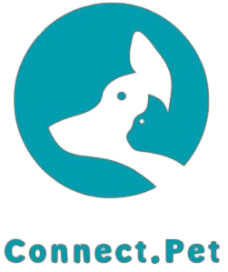

`CURSO: Sistemas de Informação`

`DISCIPLINA: Projeto - Aplicações Web`

`SEMESTRE: 1º`

Com a crescente conscientização das pessoas perante a causa animal, onde existem pessoas interessadas em adotar e/ou ajudar um animal abandonado e muitas ONGs com superlotação de animais, o projeto foi pensado para ser um facilitador e um intermediário entre os adotantes e as ONGs.

## Integrantes

- Angelica Sofia Nieves
- Laryssa Serra de Oliveira
- Cássio de Melo Rabelo
- Paola Andrea Ariza Cordoba
- Elisângela Dias da Silva
- Gabriela Farias Rios

## Orientador

- Luciana De Nardin

# Planejamento

|  Etapa  |         Período         | Atividades                                                                                                   |
| :-----: | :---------------------: | ------------------------------------------------------------------------------------------------------------ |
| ETAPA 1 | 07/03/2022 - 01/04/2022 | [Documentação de Contexto](docs/context.md)   [Especificação do Projeto](docs/especification.md)          |
| ETAPA 2 | 04/04/2022 - 29/04/2022 | [Projeto de Interface](docs/interface.md)   [Template Padrão](docs/template.md)                           |
| ETAPA 3 | 02/05/2022 - 27/05/2022 | [Programação de Funcionalidades - HTML e CSS](docs/development.md)                                           |
| ETAPA 4 | 30/05/2022 - 24/06/2022 | [Programação de Funcionalidades - Javascript](docs/development.md)   [Testes de Software ](docs/tests.md) |
| ETAPA 5 | 27/06/2022 - 08/07/2022 | [Apresentação](presentation/README.md)                                                                       |

<!-- # Código

<li><a href="src/README.md"> Código Fonte</a></li> -->

# Apresentação

<li><a href="presentation/README.md"> Apresentação da solução</a></li>
