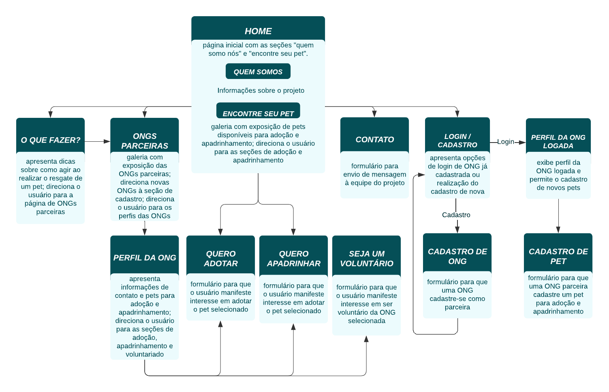
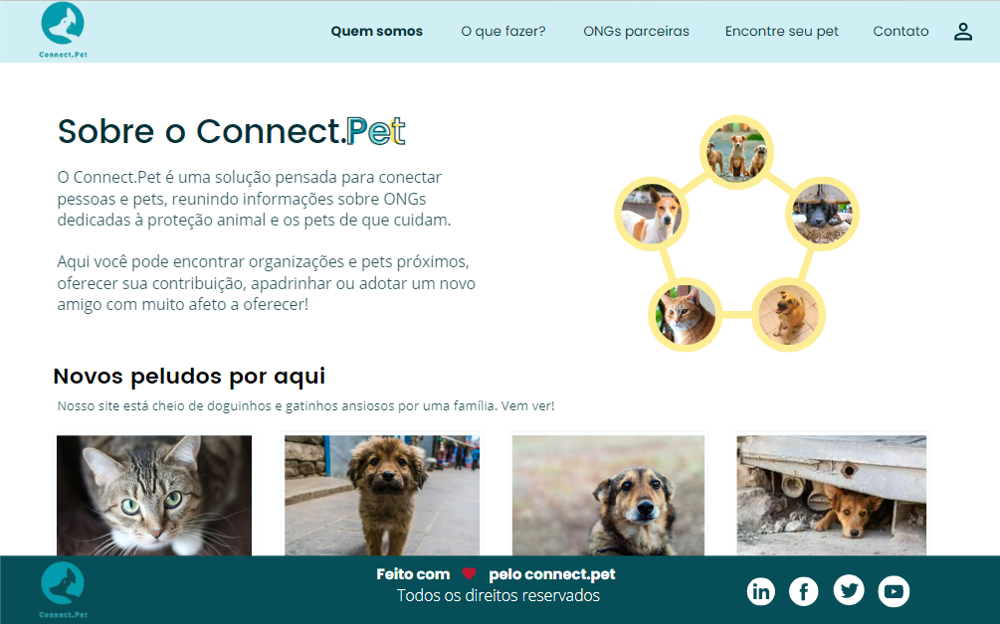

# Projeto de Interface

Nossa aplicação tem o intuito de possuir um fluxo simples e intuitivo e é composta por 5 seções principais, sempre disponíveis no menu, e 6 secundárias, com ações específicas e acesso a partir das primeiras. A forma de organização tem o objetivo de facilitar ao usuário a obtenção de informações, a conexão com ONGs próximas e a manifestação de seu desejo em prestar trabalho voluntário, adotar ou apadrinhar.

As seções principais são:

- **quem somos:** apresenta informações sobre o projeto;
- **encontre seu pet:** apresenta uma galeria de pets para adoção ou apadrinhamento, com a possibilidade de busca com filtros; a partir dela é possível ir para os formulários de adoção ou apadrinhamento;
- **o que fazer:** mostra dicas sobre como proceder no processo de resgate de um pet, com direcionamento para a página de ONGs parceiras, as quais podem servir como ponto de apoio;
- **ONGs parceiras:** apresenta as ONGs, possibilitando ao usuário realizar busca por localização e acessar o perfil da ONG desejada, onde poderá manifestar seu desejo de ser voluntário, adotar ou apadrinhar pets daquela instituição; também permite às ONGs parceiras o cadastro de seus pets e a novas organizações o cadastro para tornarem-se parceiras;
- **contato:** permite o envio de mensagens à equipe do projeto Connect.Pet.
- **login:** permite que uma ong cadastrada faça login na aplicação para que adicione pets para adoção.

## User Flow

 

## Wireframes

### 1. Home
Página inicial com as seções "Quem somos" e "Encontre seu pet".

#### 1.1 Quem somos
Contém informações sobre os objetivos e funcionalidades da aplicação.

#### 1.2 Encontre seu pet
Exibe a galeria de pets disponíveis para adoção e apadrinhamento, com a possibilidade de direcionamento do usuário para o preenchimento de formulários de adoção e apadrinhamento.

### 2. O que fazer?
Apresenta dicas sobre como agir ao realizar o resgate de um pet. No fragmento de texto em que é mencionada a possibilidade de auxílio por ONGs próximas, há o direcionamento para a página de ONGs parceiras.

### 3. ONGs parceiras
Mostra as ONGs parceiras, possibilita o direcionamento para cadastro de nova ONG ou para o perfil de uma ONG selecionada.

#### 3.1 Cadastro de ONG
Formulário para cadastro de uma nova ONG parceira.

#### 3.2 Cadastro de pet
Formulário para que uma ONG parceira cadastre um novo pet para a galeria.

#### 3.3 Perfil da ONG
Exibe informações de contato e localização aproximada da ONG e animais sob sua resposabilidade que estão disponíveis para adoção e apadrinhamento, além de possibilitar o direcionamento para formulário de cadastro para oferta de trabalho voluntário àquela instituição.

#### 3.4 Seja um voluntário
Formulário para manifestação de interesse me prestar trabalho voluntário à ONG selecionada.

#### 3.5 Quero Adotar
Formulário para manifestação de interesse em adotar um pet.

#### 3.6 Quero Apadrinhar
Formulário para manifestação de interesse em apadrinhar um pet.

### 4. Login e cadastro
Formulário fazer login e atalho para o cadastro de ONG

### 5. Contato
Formulário para envio de mensagem à equipe do projeto.

## Protótipo interativo

As páginas também estão disponíveis em nosso protótipo interativo, acessível por [aqui](https://www.canva.com/design/DAE-bKxwjfI/WfIs36uUlx73hWbOs6DyFA/view?utm_content=DAE-bKxwjfI&utm_campaign=designshare&utm_medium=link&utm_source=homepage_design_menu).

